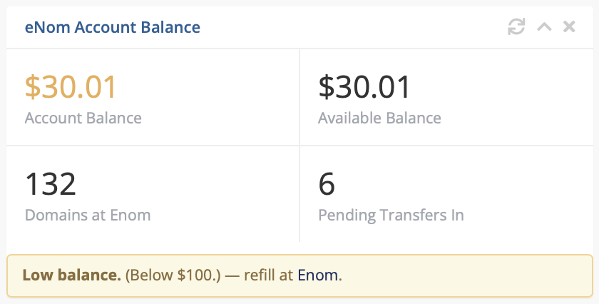

# WHMCS eNom Account Balance Widget

Admin dashboard widget for WHMCS showing your **eNom reseller account balance**,
domain count at eNom, pending transfers-in, and two-level low-balance warnings.

Plaintext replacement for the abandoned Anaxa/aspnix *Enom Balance Widget*,
which died on PHP 8.1+ (ionCube-encoded for PHP 7.1) and silently vanished
from admin dashboards.

## Install

1. Copy `modules/addons/enom_balance_widget/` into your WHMCS root's
   `modules/addons/`.
2. *Setup → Addon Modules* → **Enom Balance Widget** → **Activate**, then
   **Configure**.
3. Reload the admin dashboard.

Requires WHMCS 8.x/9.x, the **Enom** registrar module with credentials
configured (*Setup → Products/Services → Domain Registrars*), and PHP `curl`.
No core-file edits; survives WHMCS upgrades.

## What it shows

| Tile | Source |
|---|---|
| Account Balance / Available Balance | eNom `GETBALANCE` API (cached 15 min) |
| Domains at eNom | same API call |
| Pending Transfers In | local `tbldomains` table — zero API calls |

Two-level warning, configurable under *Configure*:

| Setting | Default | Effect |
|---|---|---|
| **Yellow Threshold** | `100` | Balance below → orange figure + yellow banner |
| **Red Threshold** (eNom warning level) | `30` | Balance below → pink figure + red "critically low" banner. Set to match eNom's panel warning. |
| **Widget Width** | `1` | `1` or `2` dashboard columns |

Credentials are read at runtime via WHMCS's registrar module layer — nothing
stored, nothing logged, TestMode respected.

## Notes

- eNom's own notification threshold is **write-only** via API (no read
  command), so set the Red Threshold manually to the same value.
- Tested end-to-end on WHMCS 8.13.5 / PHP 8.3; statically verified against
  WHMCS 9.0.6.

## License

MIT — see [LICENSE](LICENSE). Not affiliated with eNom or WHMCS Ltd.